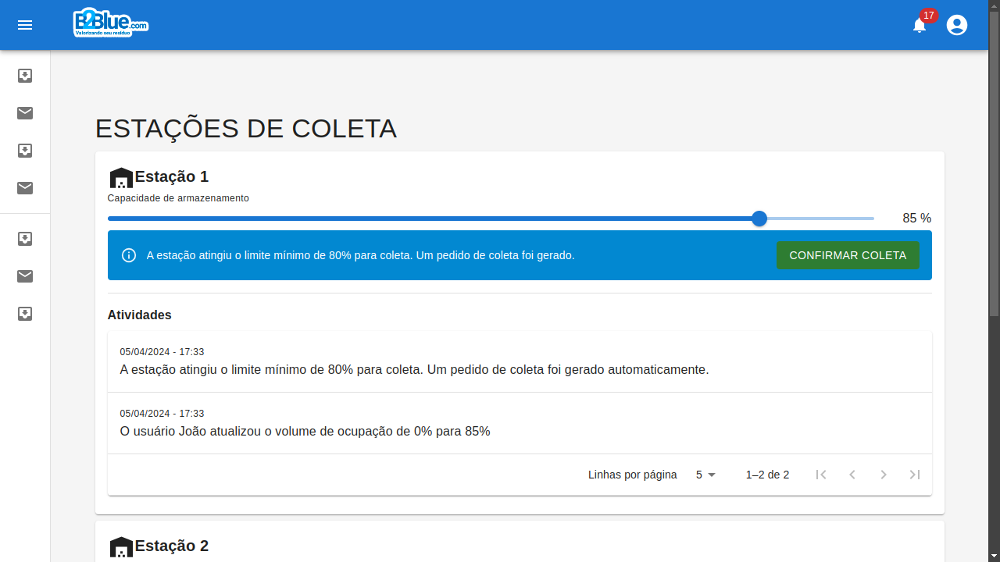
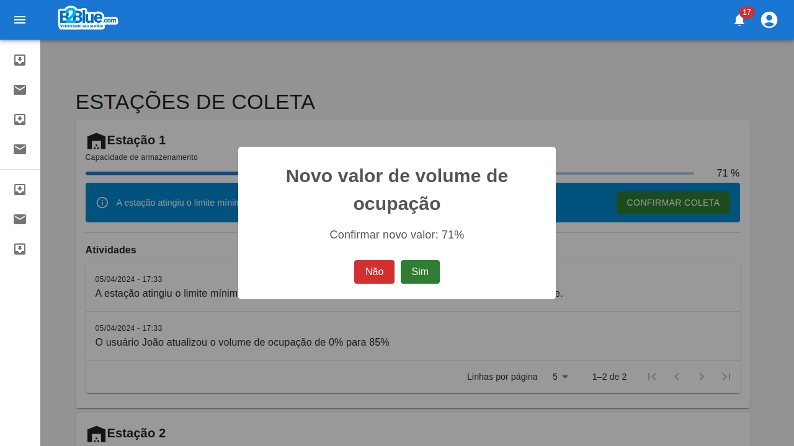
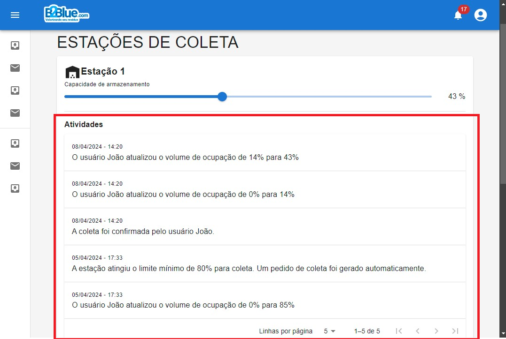

## 1 Introdução

A B2Blue é uma empresa comprometida com a gestão inteligente de resíduos e também com o cuidado ambiental, cuja missão é criar soluções inovadoras para tornar o mundo mais limpo e sustentável.

## 2 Objetivos

Considerando que os resíduos são armazenados em estações, o objetivo desse sistema é auxiliar as pessoas envolvidas a gerenciar o volume de ocupação em cada estação, bem como gerenciar as solicitações de coleta.
O usuário do sistema vai informar (em porcentagem) a ocupação de cada armazém. Quando a ocupação for igual ou maior que 80%, o sistema automaticamente vai gerar uma solicitação de coleta. Quando a coleta for realizada, o usuário informa ao sistema através de um botão para confirmar a coleta, e o sistema vai reiniciar para 0% de volume de ocupação na estação indicada.

## 3 Usabilidade

A página inicial lista todas as estações disponíveis.

Utilize o slider para atualizar o valor de ocupação da estação. Um modal de confirmação vai aparecer na tela para confirmar a ação.

Todas as ações são registradas na tabela de atividades de cada estação.

## 4 Conclusão

Com este sistema, o usuário consegue ter uma visão do volume de armazenamento das estações, bem como pode gerenciar o valor do volume e verificar o histórico dos logs de atividades em cada estação.
